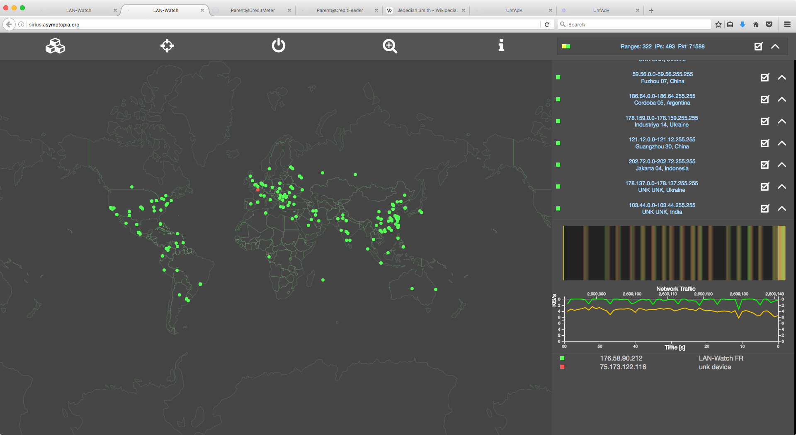

# Raspberry-Pi 3 Debian Files for CreditMeter

This repository contains various configuration files and other source code used
to build the Raspberry-Pi 3 CreditMeter device.

## Getting Started

### Installation of base Debian 7 (Jessie) system
Download the official Raspbian Jessie Lite (February 2017) from the
[raspberrypi.org website] (https://www.raspberrypi.org/downloads/raspbian/).  
The Lite version does not have a Desktop or X-Windows system.
Use at least an 8G micro SD card to install the image.  
After the initial install update your package list:
```
	apt-get update
```

## WiFi Setup: wlan0 dhclient
Edit /etc/wpa_supplicant/wpa_supplicant.conf
At the end, add the section:
```
network={
	ssid="<your ssid in quotes>"
	scan_ssid=1
	key_mgmt=WPA-PSK
	psk="<your password in quotes>"
}
```

Reboot and verify that you have an IP address using ifconfig and iwconfig.
The default install runs dhcpcd automatically if your wpa_supplicant.conf if ok.
You should be able to ping something familiar, like cnn.com.  If you see cnn's
IP address then your DNS is working.  If not, check your /etc/resolv.conf.
When you have internet access via wlan0 then issue "apt-get update".


## WiFi Setup: wlan1 hostapd
I'm using an Edimax USB nano WiFi adapter running in Master mode, as set by
hostapd (access  point daemon).  The hostapd part allows you to connect to the
Raspberry-Pi3 via WiFi.  The dnsmasq part takes care of giving you an IP address
and managing your DNS needs.

Install hostapd and dnsmasq:
```
	apt-get install hostapd dnsmasq
```

Edit /etc/hostapd/hostapd.conf
```
	interface=wlan1
	ssid=rpi3
	hw_mode=g
	channel=3
	wpa=2
	wpa_key_mgmt=WPA-PSK
	wpa_passphrase=raspberry
```

Edit /etc/network/interfaces
```
	iface wlan1 inet static
		address 192.168.1.1
		netmask 255.255.255.0
		network 192.168.1.0
		broadcast 192.168.1.255
```

Edit /etc/dnsmasq.conf (line 157)
```
	dhcp-range=192.168.1.50,192.168.1.150,12h
```

systemctl enable dnsmasq

Edit /etc/defaults/hostapd
```
	DAEMON_CONF="/etc/hostapd/hostapd.conf"
```

Issue the following commands:
```
	systemctl enable ssh
	service sshd start
```
Reboot, connect to rpi3 and ssh into your Raspberry-Pi.

##Router configuration (wide-open)
At this point your Raspberry-Pi isn't forwarding your traffic through to the
internet.  For this you need to configure IPTables.  Here is a python script
to make it easier (see /creditmeter/daemons/utils.py):

```
#!/usr/bin/env python
import os

LAN0="eth0"
LAN1="wlan1"
WAN="wlan0"

def getWideOpenPolicy():
	wide_open=[
		iptables -F
		iptables -t nat -F
		iptables -P INPUT ACCEPT
		iptables -P OUTPUT ACCEPT
		iptables -P FORWARD ACCEPT
		iptables -I INPUT 1 -i ${LAN0} -j ACCEPT
		iptables -I INPUT 1 -i ${LAN1} -j ACCEPT
		iptables -I INPUT 1 -i lo -j ACCEPT
		iptables -A INPUT -p UDP --dport bootps ! -i ${LAN0} -j REJECT
		iptables -A INPUT -p UDP --dport bootps ! -i ${LAN1} -j REJECT
		iptables -A INPUT -p UDP --dport domain ! -i ${LAN0} -j REJECT
		iptables -A INPUT -p UDP --dport domain ! -i ${LAN1} -j REJECT
		iptables -A INPUT -p TCP --dport ssh -i ${WAN} -j ACCEPT
		iptables -I FORWARD -i ${LAN0} -d 192.168.0.0/255.255.0.0 -j ACCEPT
		iptables -I FORWARD -i ${LAN1} -d 192.168.0.0/255.255.0.0 -j ACCEPT
		iptables -A FORWARD -i ${LAN0} -s 192.168.0.0/255.255.0.0 -j ACCEPT
		iptables -A FORWARD -i ${LAN1} -s 192.168.0.0/255.255.0.0 -j ACCEPT
		iptables -A FORWARD -i ${WAN} -d 192.168.0.0/255.255.0.0 -j ACCEPT
		iptables -t nat -A POSTROUTING -o ${WAN} -j MASQUERADE
		iptables-save
		#REFERENCE: http://wiki/gentoo.org/wiki/Home_Router
	]
	return wide_open

cmds=getWideOpenPolicy()
for cidx in range(len(cmds)):
	cmd=cmds[cidx]
	os.system(cmd)
```

After this issue iptables-save and you should have internet access via your
Raspberry-Pi's WiFi access point.


## Other nice things to have
Arguably the most useful Linux command: locate
```
	apt-get install mlocate
	updatedb

	usage: locate <anything>
	example: locate hostapd.conf

	apt-get install links (curses-based browser)
```

You will soon need git to clone the creditmeter repository:
```
	apt-get install git
```

## Web Server(s)
Install nginx as the default system web server. We will also configure uwsgi
as the communication layer between nginx and Django, the Python web framework.
```
apt-get install nginx uwsgi
```

We tell the system to start nginx at boot:
```
root@raspberrypi:/var/www# systemctl enable nginx
Synchronizing state for nginx.service with sysvinit using update-rc.d...
Executing /usr/sbin/update-rc.d nginx defaults
Executing /usr/sbin/update-rc.d nginx enable
```

Now you've got to edit /etc/nginx/sites-enabled/default; this implicitely
specifies wlan1 because that's the interface with this IP, as per what we set in
/etc/network/interfaces.
```
	listen 192.168.1.1:80 default_server;
```

Verify that the default nginx page is working at 192.168.22.1:80.


### CreditMeter Interface

The CreditMeter interface is installed inside a python (3.5) virtualenv at /var/www/meter
as follows:
```
apt-get install python-cxx-dev
apt-get install sqlite3
apt-get install virtualenv python3-virtualenv
cd /var/www
virtualenv -p /usr/bin/python3 meter
cd meter
source bin/activate
apt-get install python3-cxx-dev
apt-get install libpcre3 libpcre3-dev
pip install uwsgi
pip3 install django django-picklefield
django-admin startproject meter .
chmod +x ./manage.py
./manage.py startapp creditmeter
```


### Configuring nginx, uwsgi and django

Here are the two resources used to configure uwsgi and django:
* [How to use Django with uWSGI](https://docs.djangoproject.com/en/1.10/howto/deployment/wsgi/uwsgi/)
* [Setting up Django and your web server with uWSGI and nginx](http://uwsgi-docs.readthedocs.io/en/latest/tutorials/Django_and_nginx.html)

There are three important configuration files located in the root directory
of the repository:
* /etc/nginx/sites-available/ndjinx_nginx.conf
* /var/www/ev/uwsgi_params
* /var/www/ev/nginx_uwsgi.ini


The last file, nginx_uwsgi.ini, refers to a socket at /var/www/meter/ndjinx.sock
which gets created by the nginx_uwsgi.ini file.  It should look like this after
being created by the script and uwsgi is running:
```
root@raspberrypi:/var/www# ls -l /var/www/ev/ndjinx.sock
srw-rw-rw- 1 www-data www-data 0 Mar  2 13:17 /var/www/ev/ndjinx.sock
```

We need to set two dynamic links as follows:
```
cd /etc/nginx/sites-enabled
ln -s /var/www/meter/ndjinx_nginx.conf meter

cd /etc/uwsgi
mkdir vassals;cd vassals
ln -s /var/www/meter/ndjinx_uwsgi.ini ndjinx_uwsgi.ini
```

Then move the ./etc/rc.local to /etc:
```
mv ./etc/rc.local /etc
systemctl enable rc.local
```


The uwsgi daemon is started from /etc/rc.local, which can be copied from this
repository.  Important Note:  The default /etc/rc.local has "#!/bin/sh -x" at
the top.  This needs to be replaced with "#!/bin/bash" else scripts fail.  The
copy from this repository contains the change, but in case you have chosen to
edit /etc/rc.local, rather than copying-in, then this is important to know!
```
/usr/local/bin/uwsgi --emperor /etc/uwsgi/vassals --uid www-data --gid www-data --touch-reload /var/www/meter/creditmeter/views.py --daemonize /var/log/uwsgi-emperor.log
```

The above command uses the --touch-reload flag, which tells uwsgi to reload
whenever the creditmeter's views.py file is modified or touched, which is important
during development.  


### Design of the website

The default Django webpage should be viewable at http://192.168.22.1.  
The website is a standard Django website in which requests are routed according
to the urls.py file, which sends each request to the appropriate handler of a
views.py file. Here is the essential file structure from the repository:
```
meter/
+-- __init__.py
+-- settings.py
+-- urls.py
+-- wsgi.py
creditmeter/
+-- daemon
|   +-- daemon.py
|   +-- creditmeterd
+-- meter.log
+-- __init__.py
+-- models.py
+-- static
|   +-- creditmeter
|       +-- css
|       |   +-- creditmeter.css
|       +-- images
|           +-- logo.png
+-- templates
|   +-- device_login.html
|   +-- parent_app.html
|   +-- student_app.html
+-- views.py
```

The Django backend cannot issue the system-wide configuration commands such
as the iptables commands necessary to control the firewall.
For this we use a daemon and send commands to it using RPC (Remote Procedure
Calls) on port 8007 (arbitrary and hard-coded at the moment).  

The daemon is located in /var/www/meter/creditmeter/daemon/creditmeterd and derives from the
daemon.py in the same directory.  The daemon is started by /etc/rc.local, the
same place that we started the uwsgi daemon.  

The running of /etc/rc.local during startup is actually a service which is
managed like so:
```
systemctl enable (disable) rc.local
```

### settings.py and urls.py

In settings.py you should edit ALLOWED_HOSTS, INSTALLED_APPLICATIONS and
STATIC_ROOT.  The rest should be covered by defaults.  
```
INSTALLED_APPS = [
    ...
    'creditmeter',
]
ALLOWED_HOSTS = [192.168.1.1,]
STATIC_URL = '/static/'
STATIC_ROOT = '/var/www/meter/static/'
```

Make sure the directory /var/www/meter/static is defined.  
Also ensure that permissions are sufficient by issuing
"chown -R www-data /var/wwww/meter".

In urls.py needs to contain the following:
```
urlpatterns = [
    url(r'^load_student$',creditmeter_views.load_student,name='load_student'),
    url(r'^save_student$',creditmeter_views.save_student,name='save_student'),
    url(r'^status_update$',creditmeter_views.status_update,name='status_update'),
    url(r'^logout$',creditmeter_views.logout_view,name='logout'),
    url(r'^keepalive$',creditmeter_views.keepalive,name='keepalive'),
    url(r'^get$',creditmeter_views.get,name='creditmeter_get'),
    url(r'^$',creditmeter_views.home,name='home'),
]
```

### Database

The CreditMeter website adds a userprofile to the default Django user model:
```
class UserProfile(models.Model):
	user = models.OneToOneField(User, unique=True, on_delete=models.CASCADE)
	is_parent = models.BooleanField(default=False)
	credit_balance = models.IntegerField(default=1000)
	remote_username = models.CharField(max_length=20,blank=False)
	remote_password = models.CharField(max_length=20,blank=False)
	mac_addrs=PickledObjectField(default=[])

	def __unicode__(self):
		return self.user.username
```


The database is initialized using Django's ./manage.py script.
From within the virtualenv perform initial migration Django's database:
```
cd /var/www/meter
chmod +x ./manage.py
./manage.py makemigrations
./manage.py migrate
./manage.py createsuperuser
...<follow prompts>...
```

The above will initialize the database and create a table for the userprofile model.


### Static files

Django has a convention for managing static files.  Once the static file
pointers and locations have been created and specified (above) you need to
collect the static files using ./manage.py like this:
```
cd /var/www/meter
./manage.py collectstatic
```



